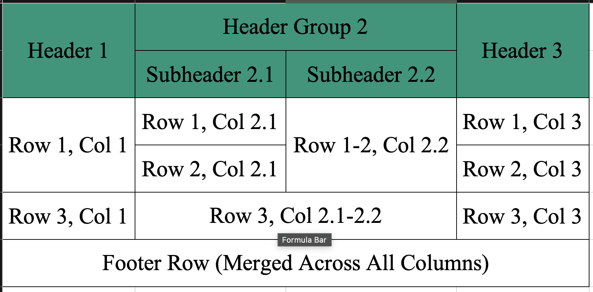

# HTML to Excel Converter

Convert HTML tables to Excel files with beautiful styling preservation and support for complex table structures.

## Features

- ✨ Preserves table styling (colors, borders, fonts)
- 📊 Supports complex table structures (merged cells, rowspan, colspan)
- 🎨 Maintains CSS styling from both inline and stylesheet
- 📑 Handles multiple tables in a single document
- 🚀 Memory efficient for large tables
- 🔄 Support for nested tables

## Example Result

## Prerequisites

- Node.js >= 14.0.0
- Python 3.x

## Installation

```bash
npm install html-to-excel-converter
```

```bash
yarn add html-to-excel-converter
```

```bash
bun add html-to-excel-converter
```

The package will automatically set up a Python virtual environment and install required dependencies during installation.

## Usage

### Basic Example

```javascript
const HTMLToExcelConverter = require('html-to-excel-converter');

// Create a new instance
const converter = new HTMLToExcelConverter();

// Convert HTML to Excel
try {
    const excelBuffer = await converter.convert(html, 'output.xlsx');
    console.log('Conversion successful!');
} catch (error) {
    console.error('Conversion failed:', error);
}
```

### Complex Example

Here's a complete example showing a complex HTML table with merged cells, styling, and multiple rows:

Input HTML Table:

```html
<!DOCTYPE html>
<html lang="th">
<head>
    <meta charset="UTF-8">
    <style>
        .complex-table {
            border-collapse: collapse;
            width: 100%;
            max-width: 800px;
            margin: 20px auto;
            font-family: 'Segoe UI', Tahoma, Geneva, Verdana, sans-serif;
            box-shadow: 0 0 20px rgba(0, 0, 0, 0.1);
        }

        .complex-table th, 
        .complex-table td {
            padding: 12px 15px;
            text-align: center;
            border: 1px solid #ddd;
        }

        .complex-table thead {
            background-color: #009879;
            color: #ffffff;
        }

        .complex-table tbody tr:nth-of-type(even) {
            background-color: #f3f3f3;
        }

        .footer-row {
            background-color: #e7f6f3;
            font-weight: bold;
            color: #009879;
        }
    </style>
</head>
<body>
    <table class="complex-table">
        <thead>
            <tr>
                <th rowspan="2">Header 1</th>
                <th colspan="2">Header Group 2</th>
                <th rowspan="2">Header 3</th>
            </tr>
            <tr>
                <th>Subheader 2.1</th>
                <th>Subheader 2.2</th>
            </tr>
        </thead>
        <tbody>
            <tr>
                <td rowspan="2">Row 1, Col 1</td>
                <td>Row 1, Col 2.1</td>
                <td rowspan="2">Row 1-2, Col 2.2</td>
                <td>Row 1, Col 3</td>
            </tr>
            <tr>
                <td>Row 2, Col 2.1</td>
                <td>Row 2, Col 3</td>
            </tr>
            <tr>
                <td>Row 3, Col 1</td>
                <td colspan="2">Row 3, Col 2.1-2.2</td>
                <td>Row 3, Col 3</td>
            </tr>
            <tr class="footer-row">
                <td colspan="4">Footer Row (Merged Across All Columns)</td>
            </tr>
        </tbody>
    </table>
</body>
</html>
```

Output Excel File:




This HTML will be converted to Excel maintaining:
- Merged cells (rowspan and colspan)
- Background colors
- Border styles
- Text alignment
- Font styles and colors
- Custom CSS classes

## API Options

You can customize the converter behavior by passing options:

```javascript
const converter = new HTMLToExcelConverter({
    venvPath: 'custom/venv/path',    // Custom Python virtual environment path
    maxChunkSize: 5 * 1024 * 1024,   // 5MB chunk size
    timeout: 10 * 60 * 1000,         // 10 minutes timeout
    maxBuffer: 50 * 1024 * 1024,     // 50MB buffer size
    debug: true                       // Enable debug logging
});
```

### Options

| Option | Type | Default | Description |
|--------|------|---------|-------------|
| venvPath | string | 'venv' | Path to Python virtual environment |
| maxChunkSize | number | 5MB | Maximum size of data chunks |
| timeout | number | 10min | Timeout for conversion process |
| maxBuffer | number | 50MB | Maximum buffer size for Python process |
| debug | boolean | false | Enable debug logging |

## Error Handling

The converter provides detailed error information:

```javascript
try {
    await converter.convert(html, 'output.xlsx');
} catch (error) {
    if (error.type === 'PYTHON_NOT_FOUND') {
        console.error('Python installation not found');
    } else if (error.type === 'INVALID_HTML') {
        console.error('Invalid HTML structure');
    } else if (error.type === 'CONVERSION_FAILED') {
        console.error('Conversion process failed:', error.details);
    }
}
```

## License

MIT License - see LICENSE file for details
